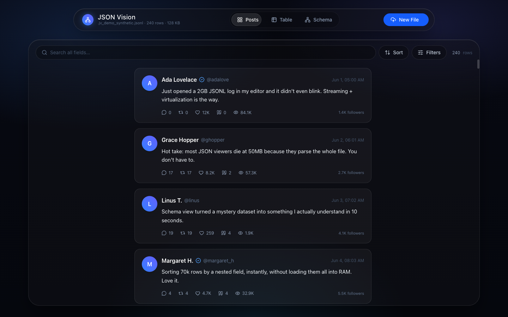
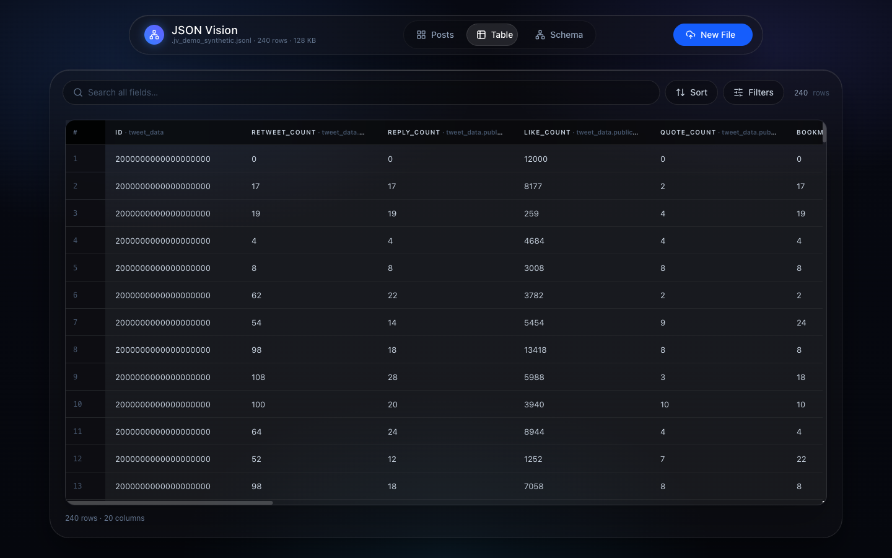
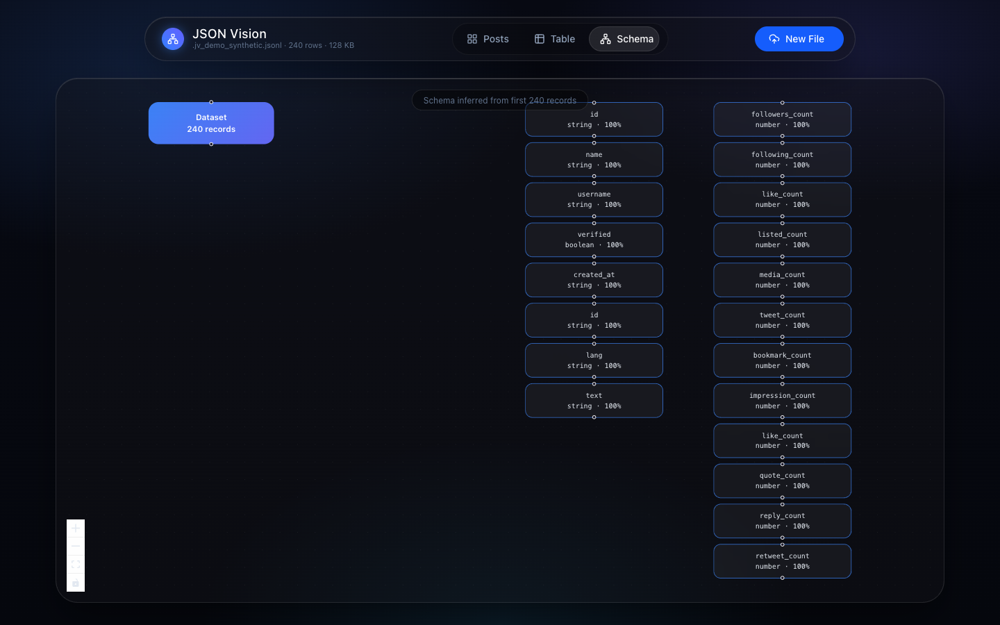
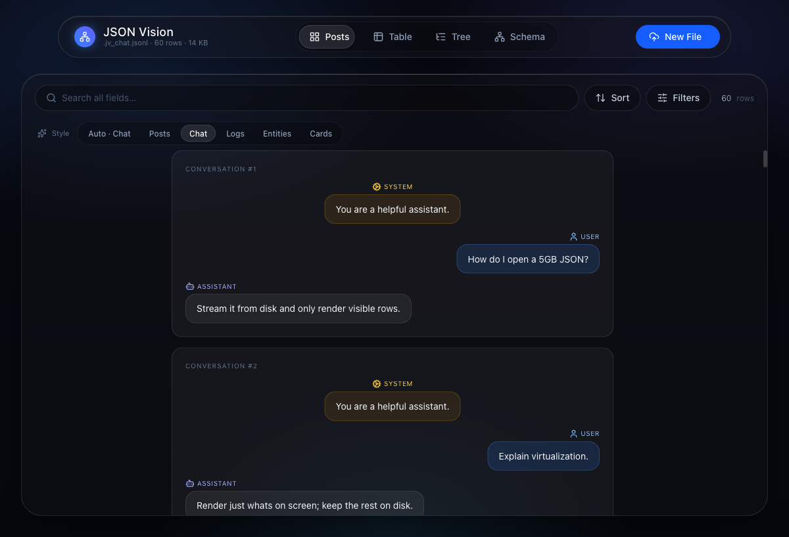
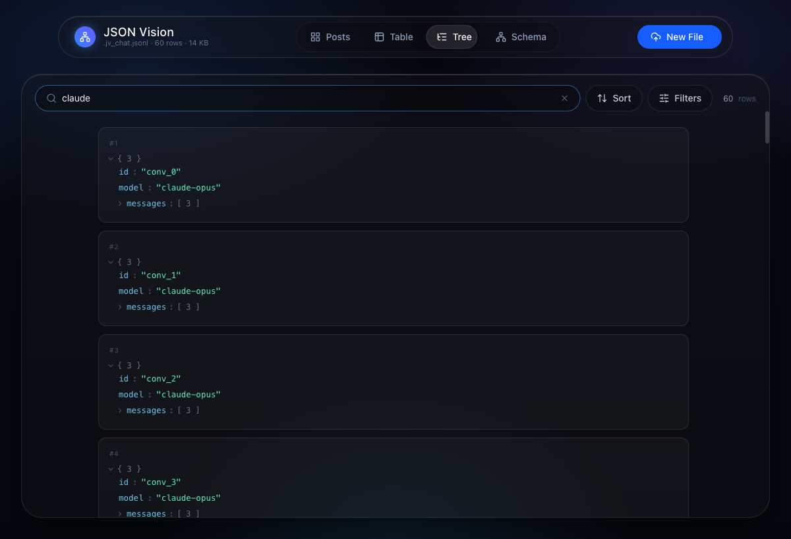

<div align="center">


# JSON Vision

### Open multi-GB JSON & JSONL in your editor — without freezing.

**The large JSON / JSONL / NDJSON viewer that streams files from disk** and renders them as virtualized **tables**, **posts**, and **schema graphs** — with live search, filter, and sort. Works in **VS Code, Antigravity, Cursor, Windsurf, and VSCodium**. 100% local — your data never leaves your machine.

<br/>

[](https://marketplace.visualstudio.com/items?itemName=aimyerdaulet.json-vision)
[](https://marketplace.visualstudio.com/items?itemName=aimyerdaulet.json-vision)
[](https://open-vsx.org/extension/aimyerdaulet/json-vision)
[](LICENSE)
[](https://github.com/yerdaulet-damir/json-vision)

<br/>



</div>

---

## Why JSON Vision

**Most JSON viewers die on big files because they load the whole file into memory and parse it up front.** VS Code itself freezes on large JSON — a 40 MB / 1.4M‑line file can hang the editor, and files over ~50 MB trigger *"Window no longer responding."* Popular viewers inherit the same model: JSON Crack, JSON Grid Viewer, and most table extensions choke somewhere between 10 MB and 50 MB. For anything bigger, the usual advice is *"use a desktop app or a CLI."*

**JSON Vision is the exception.** It never loads the whole file. It streams the file once to index where each line begins, then reads **only the rows currently on screen** by seeking to their byte offsets. Search, filter, and sort run as a single streaming pass. The result: an **84 MB / 72,143‑line JSONL file indexes in ~80 ms and scrolls at 60 fps**, and multi‑gigabyte files open just as smoothly.

---

## JSON Vision vs. the alternatives

| | **JSON Vision** | Native VS Code | JSON Crack | Data Preview | `jq` (CLI) |
|---|:---:|:---:|:---:|:---:|:---:|
| Opens multi‑GB files | ✅ | ❌ freezes | ❌ | ⚠️ ~tens of MB | ✅ |
| Streams from disk (flat memory) | ✅ | ❌ | ❌ | ❌ | ✅ |
| JSONL / NDJSON first‑class | ✅ | ⚠️ | ⚠️ | ✅ | ✅ |
| Virtualized table view | ✅ | ❌ | ❌ | ✅ | ❌ |
| Schema / structure graph | ✅ | ❌ | ✅ | ❌ | ❌ |
| Live search + filter + sort (whole file) | ✅ | ⚠️ find only | ❌ | ⚠️ | ✅ (manual) |
| Visual, in‑editor | ✅ | ✅ | ✅ | ✅ | ❌ |
| 100% local, zero network | ✅ | ✅ | ⚠️ web | ✅ | ✅ |

> **The gap it fills:** there's no other VS Code extension that confidently opens multi‑GB JSONL. JSON Vision opens the files the others tell you to leave the editor for.

---

## Features

<table>
<tr>
<td width="50%" valign="top">

### 📰 Posts &nbsp;·&nbsp; 🌳 Tree
Auto‑detects record shape (tweets, **chat/LLM logs**, server logs, REST entities) and renders the right card style — or read raw structure in the collapsible **Tree** view.


</td>
<td width="50%" valign="top">

### 🧮 Table
Virtualized grid with **flattened dot‑path columns** (`a.b.c`). Click any header to sort the entire dataset.



</td>
</tr>
<tr>
<td width="50%" valign="top">

### 🕸️ Schema
Inferred structure graph — every field with its **type(s)** and **fill‑rate** across the dataset.



</td>
<td width="50%" valign="top">

### 🔎 Live query
- **Search** — full‑text across every field, debounced.
- **Filter** — `contains`, `=`, `≠`, `>`, `≥`, `<`, `≤`, `exists`, `is empty`.
- **Sort** — any column, ascending/descending, over the whole file.

</td>
</tr>
</table>

---

## It adapts to your data

JSON comes in many shapes, so JSON Vision **auto‑detects the record shape** and renders it in the right native style — and you can always switch styles manually. No config.

| Your data looks like… | JSON Vision shows… |
|---|---|
| Tweets / social / API feeds | **Posts** — avatars, metrics, timestamps |
| LLM logs (`role` / `content`, `messages[]`) | **Chat** — color‑coded conversation bubbles |
| Server logs (`level` + `message`) | **Logs** — severity badges, timestamps, fields |
| GitHub / REST entities (`html_url`, stars) | **Entities** — title, description, stats |
| Anything else | **Cards** — clean key/value, or the **Tree** view |

<div align="center">


</div>

The **Tree** view is the classic collapsible JSON viewer — type‑colored and virtualized, so even a 70k‑record file expands instantly.

---

## How do I open a huge JSON file without freezing?

Install JSON Vision, then **right‑click any `.json` / `.jsonl` / `.ndjson` file → "Open in JSON Vision"** (or run the command from the editor title bar). It opens as an *option*, so your default JSON editor is never hijacked.

```bash
# VS Code
code --install-extension aimyerdaulet.json-vision

# Cursor / Windsurf / Antigravity / VSCodium (via Open VSX)
#   Command Palette → "Extensions: Install from VSIX…"  (or search "JSON Vision")
```

Prefer the browser? The same engine ships as a **web app** — drag in a file and it pages from disk via the File API:

```bash
git clone https://github.com/yerdaulet-damir/json-vision
cd json-vision && npm install && npm run dev
```

---

## How it stays fast

The whole design is one idea: **never hold the file in memory, never render what isn't on screen.**

| Stage | How |
|---|---|
| **Indexing** | Stream the file once, recording each line's **byte offset**. Newlines are found at the byte level — no full decode, no full `JSON.parse`. |
| **Reading** | Read only the visible rows, by seeking to their byte offsets (`File.slice` on web, `fs` on the extension host). |
| **Search / filter / sort** | One streaming pass builds a display **order** (array of matching row indices); visible rows are then fetched by random access. |
| **Rendering** | Virtualized — the DOM only ever holds the ~30 rows/cards on screen. |
| **Memory** | Resident pages are LRU‑capped, so RAM stays flat no matter the file size. |

**Measured on an 84 MB / 72,143‑row JSONL:** index ≈ **80 ms**, worst frame **12 ms** (60 fps), search/sort/filter in **< 0.5 s** — identical results on web and in the editor, because both share one pure query engine.

---

## Privacy

JSON Vision makes **zero network requests**. There is no telemetry, no analytics, no upload — verified in the source (no `fetch`, no sockets, no beacons) and shipped with a self‑contained CSS background (no external images). **Your data never leaves your machine.** This matters when the file is a production export, a database dump, or anything you can't paste into an online viewer.

---

## Repository layout

```
json-vision/
├─ src/
│  ├─ data/                 # runtime-agnostic data layer
│  │  ├─ query.ts           #   pure search/filter/sort engine (shared web + host)
│  │  ├─ indexWorker.ts     #   browser Web Worker: index + page a File
│  │  ├─ FileDataSource.ts  #   browser DataSource (File.slice paging)
│  │  └─ VscodeDataSource.ts#   webview DataSource (postMessage bridge)
│  ├─ components/           # TableView, CardsView (Posts), GraphView, Toolbar
│  └─ App.tsx
└─ extension/
   ├─ src/extension.ts       # CustomReadonlyEditorProvider + webview bridge
   └─ src/indexer.ts         # Node fs paging engine (imports the shared query.ts)
```

The browser worker and the Node host import the **same** `src/data/query.ts`, so search/filter/sort can never diverge between web and extension.

---

## FAQ

### Why does VS Code freeze on large JSON files?
Because the editor loads the entire file into a text model and tokenizes it up front. Past ~10–50 MB (or any very long single line) this exhausts the main thread. JSON Vision sidesteps it by streaming from disk and virtualizing the view.

### What's the best VS Code extension for large JSONL / NDJSON?
JSON Vision is purpose‑built for it: JSONL and NDJSON are first‑class, it streams multi‑GB files from disk, and it never loads everything into memory. Most other JSON extensions parse the whole document and stall on big files.

### How big a file can it open?
There's no hard ceiling — memory stays flat because only on‑screen rows are read. An 84 MB / 72k‑line file indexes in ~80 ms; multi‑gigabyte JSONL works the same way, bounded by disk speed, not RAM.

### Does it work in Cursor, Windsurf, and Antigravity?
Yes. JSON Vision publishes to **Open VSX**, the marketplace those editors use, and ships as a single `.vsix`.

### How do I open a 1GB / 5GB JSON or JSONL file?
Install JSON Vision, right‑click the file → **Open in JSON Vision**. It indexes line offsets by streaming the file once, then reads only the rows on screen — so gigabyte files open without loading into memory.

### Is JSON Vision a good JSON Crack or Dadroit alternative?
Yes, for large files specifically. JSON Crack is great for *small* JSON graphs but struggles on big files; Dadroit is a separate desktop app. JSON Vision gives you the visual views **inside your editor** and is built to stream multi‑GB JSONL. It's free and open‑source (MIT).

### Does it handle nested JSON and arrays?
Yes — the Table view flattens nested objects into dot‑path columns (`a.b.c`), and the Tree view shows the full nested structure, collapsible and type‑colored.

### Can it view server logs or LLM/chat logs?
Yes. JSON Vision auto‑detects the record shape: server logs (`level` + `message`) render with severity badges, and LLM logs (`role` / `content`, `messages[]`) render as a color‑coded chat. You can also switch styles manually.

### Is my data sent anywhere?
No. Zero network requests, zero telemetry, zero external assets. Everything runs locally — safe for production exports and database dumps.

---

## Alternatives & comparison

Looking for a **large JSON viewer**, a **JSON Crack alternative for big files**, or a **free Dadroit alternative**? Here's the honest landscape:

| Tool | Type | Large‑file (multi‑GB) | In‑editor | Visual views | Cost |
|---|---|:---:|:---:|:---:|---|
| **JSON Vision** | VS Code ext + web | ✅ streams from disk | ✅ | Posts · Table · Tree · Schema | Free / MIT |
| JSON Crack | ext + web | ❌ graph explodes | ✅ | Graph | Freemium |
| Dadroit JSON Viewer | desktop app | ✅ | ❌ | Tree | Freemium |
| Data Preview | VS Code ext | ⚠️ ~tens of MB | ✅ | Grid · charts | Free |
| jq | CLI | ✅ | ❌ | None | Free |
| Native VS Code editor | built‑in | ❌ freezes | ✅ | Text | Free |

If you only need a small JSON graph, JSON Crack is lovely. If you need to open the **huge** files those tools choke on — without leaving your editor — that's exactly what JSON Vision is for.

---

## Star history

<a href="https://star-history.com/#yerdaulet-damir/json-vision&Date">
  
</a>

> ⭐ If JSON Vision saved you from a frozen editor, a star helps other developers find it.

---

## Contributing

Issues and PRs welcome. `npm install` at the root for the web app; see [`extension/`](extension/) for the extension build.

**Maintainers:** run [`scripts/setup-github.sh`](scripts/setup-github.sh) once to set the repo description + 20 discovery topics via the GitHub CLI, then upload [`docs/social-preview.png`](docs/social-preview.png) under *Settings → General → Social preview*.

## License

[MIT](LICENSE)
